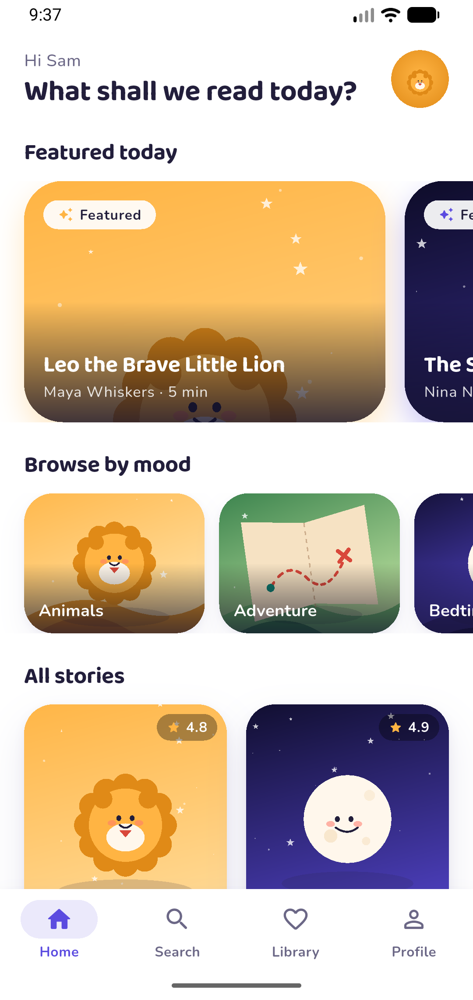
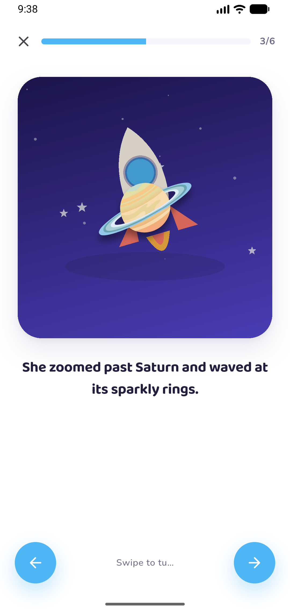
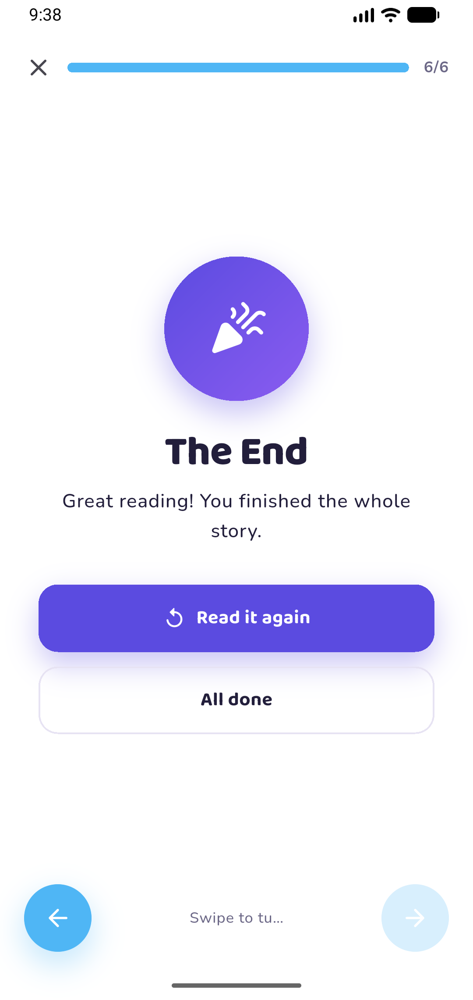

# 📚 BookaBoo

A playful, colorful storybook app for kids — built with Flutter, Riverpod, and a clean feature-first architecture.

## 📖 Overview

BookaBoo helps kids discover and read children's books through a friendly, animated interface. It was built as a university final project, with a focus on clean architecture, smooth navigation, and a gender-neutral pastel design (lavender, mint, warm cream) anchored by a bouncing "baby peeking behind a B" logo.

## 📱 Screenshots

|On Boarding| Home | Reader |
|--------|------|--------|
|

  
  
|

  
 |

  
  
|

## ✨ Features

- 🎬 Animated splash screen with logo bounce & sparkle effects
- 👋 3-page onboarding flow
- 🏠 Home with featured carousel, categories, and book grid
- 🔍 Search with query + category filters
- ❤️ Library / Favorites
- 👤 Profile with stats & settings
- 📖 Swipeable story Reader
- 🎨 Child-friendly pastel design system

## 🛠️ Tech Stack

- **Flutter** — UI toolkit
- **Riverpod** (`riverpod_generator`) — state management
- **GoRouter** — navigation (`StatefulShellRoute` for the 4-tab layout)
- **Freezed** + **json_serializable** — immutable models
- **Material Design 3**

## 🏗️ Architecture

Feature-first structure — each feature owns its `views/`, `widgets/`, and local state:

\`\`\`
lib/
├── app/            # Root widget (MaterialApp.router)
├── config/         # Theme & routes
├── core/widgets/   # Shared UI components
├── riverpod/       # App-wide providers
└── features/
    ├── splash/
    ├── onboarding/
    ├── home/
    ├── search/
    ├── library/
    ├── profile/
    ├── book_details/
    ├── reader/
    └── books/       # Shared data layer (BooksService + models)
\`\`\`

## 🚀 Getting Started

\`\`\`bash
flutter create .            # adds android/ios/etc. platform folders
flutter pub get
dart run build_runner build --delete-conflicting-outputs
flutter run
\`\`\`

> **Note:** The `*.freezed.dart` / `*.g.dart` files are hand-written bridge stubs so the project compiles right after `pub get`. Running `build_runner` replaces them with real generated code.

## 📌 Project Status

UI and core flows complete. Currently using local mock data via `BooksService` — swapping in a real backend (Supabase/Firebase) is next.

## 👩‍💻 Author

Built by **Hibat Allah Turkmany**
